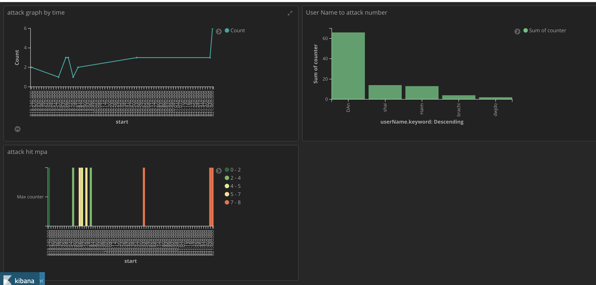

# kafka-stream-fuse-day
This Repository is a Kafka Stream example that read data from one topic, do some aggregation, and write this in Avro format to output topic. the elasticsearch connect can send this to elasticsearch and create a matching topic.

read data from input topic in this format:

```java
public class LoginData {
    String userName;
    String userPassword;
    String ip;
    Long date;
}
```
Configure a SerDe for LoginData:
look in this function loginStream.Application.getLoginDataSerde
this base on [Confluent example](https://github.com/confluentinc/kafka-streams-examples/blob/5.0.1-post/src/main/java/io/confluent/examples/streams/PageViewRegionLambdaExample.java)

build the stream:
```java
final KStream<String, LoginData> source = 
        builder.stream(INPUT_TOPIC, Consumed.with(Serdes.String(), loginDataSerde));
```

do some aggregation 

```java

KTable<Windowed<String>, Long> counts = source
        .filter((key, value) -> value != null)
        .map((key, value) -> new KeyValue<>(value.getUserName(), value))
        .groupByKey(Serialized.with(Serdes.String(), loginDataSerde))
        .windowedBy(TimeWindows.of(TimeUnit.SECONDS.toMillis(1)))
        .count();
```

create Avro Record, different schema, including the aggregation and time slicing from previous step
see method `loginStream.Application.buildRecord`

In order to cause make this happen, you need to register schema. look in class `loginStream.avroSchema.AvroSchema` which handle schema registration.
this can be done also in the CLI:
for example
```
curl -X POST -H "Content-Type: application/vnd.schemaregistry.v1+json" \
  --data '{ "schema": "{ \"type\": \"record\", \"name\": \"Persone\”, \"namespace\": \"com.ippontech.kafkatutorialse\”, \"fields\": [ { \"name\": \"firstName\", \"type\": \"string\" }, { \"name\": \"lastName\", \"type\": \"string\" }, { \"name\": \"birthDate\", \"type\": \"long\" } ]}" }' \
  http://localhost:8081/subjects/persons-avro-value/versions
```

And then, write this to output topic 
```java
.to(TOPIC, Produced.with(stringSerde, genericAvroSerde));
```

Finally this could be integrated easily with Elasticsearch
by running 
```
  ./bin/connect-standalone etc/schema-registry/connect-avro-standalone.properties \
etc/kafka-connect-elasticsearch/quickstart-elasticsearch.properties
```

just make sure to update connect-avro-standalone.properties

```properties
key.converter=org.apache.kafka.connect.storage.StringConverter
internal.key.converter=org.apache.kafka.connect.storage.StringConverter
```

and not, because key is string
```properties
key.converter=io.confluent.connect.avro.AvroConverter
```

to see if topic was deployed, run:
```
curl -XGET 'http://localhost:9200/test-elasticsearch-sink/_search?pretty'
```


:


